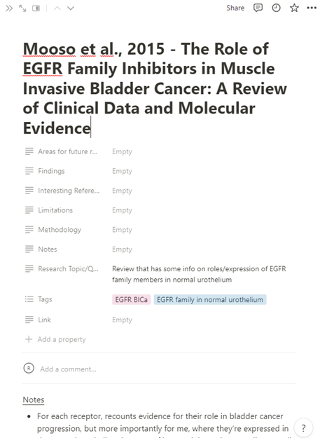

This page has some resources, both science-focused and not, that I think could be useful to PhD students.

# Non-research resources
## Job Search - Biotech 

**[BioPharmGuy](https://biopharmguy.com/)**

A directory of biotech companies, not just in the UK but around the world.

In their company [directory](https://biopharmguy.com/links/country-united-kingdom-all-location.php), they have a list of campanies, where they’re based, a link to their website, and a brief summary of what they work on. This can be a great place to start looking if you think you might want to work in industry but aren’t sure where. Or vice-versa, if you have a particular location in mind and want to find biotech companies that are nearby.

# Research recources
## Thesis writing
**[MyBib](https://www.mybib.com/)**

This is the tool I use to make reference lists for my writing. I did initially also use it to keep track of references by categories, but I found that it didn’t fully suit my needs. For more info on that, see Notion below.

The reason that I like MyBib is mostly it’s simplicity, as all you have to do is plug in the web address of a paper and it will assemble the reference from that. In terms of organisation, you can have multiple reference lists within a folder (so I have one folder for my thesis, and lists within that folder for each chapter). Finally, you have the ability to output your reference list in any common reference style you want. You can change between different reference styles if your requirements change, so this gives you a great degree of flexibility.

**[Notion](https://www.notion.so/)**

It’s difficult for me to describe what notion is really, since there’s so much stuff you can do with it. I use notion as a database and note-taking system, but you can use it to make so much more. I’d highly recommend checking out their website to get a more in-depth explanation of what it can do.

The thing that I like notion for is the ability to make databases, which is how I keep track of references. I start by making a list of tags, which you can see below. 

I then set up a table in the database, with each column representing some information on the paper. For example the tags, the authors and title, the research questions, methodology, findings, etc. Then I enter a paper, add the correct tags to it (e.g. “FGFR3 involvement in Bladder Cancer Prognosis”), and add in the information from the columns, e.g. what the methodology of the study was. You can already see that this allows you to keep a lot of information in one place. However, you can then have the entry open up a new page, which is what I use to make notes on. So I have papers organised by subject (the tags), and at a glance you can see information such as methodology and research question. Then, if you click on the name of the paper, it takes you to a separate page where you can make detailed notes on the paper. Brilliant!

## Making figures
**[Biorender](https://www.biorender.com/)**

This was really a game-changer for me. In my masters I used Adobe Illustrator to make figures, but when I started my PhD I no longer had access to it through my institution, so I started using powerpoint instead. Powerpoint is fine, but it can often feel that you’re working against the software rather than with it once your figures reach a certain level of complexity.

Biorender is great because it has a plethora of built-in icons and templates (such as proteins, DNA, organelles, the process of viral infection) that you can build your figures on. Personally I think this is huge, and is what gives Biorender such an advantage over all other software. You can even upload your own images (e.g. microscopy image of cells) to incorporate into your figures.

The second great feature is that biorender allows you to easily align objects with each other. Biorender combines many of the geat featues of other software like CorelDraw and Illustrator, without the steep learning curve.

**[Adobe Illustrator](https://www.adobe.com/uk/products/illustrator.html)**

I don’t have much to say on this. I made all of my figures in Illustrator during my masters as it gave you much more control than powerpoint, especially in terms of aligning objects next to each other. The price tag and the fact that you can’t just buy the software (you have to buy a subscription) are pretty offputting. Hence I wouldn’t recommend buying it outright, but if your institution has a subscription then go for it. Another similar option is [CorelDRAW](https://www.coreldraw.com/en/) , which I don’t have a huge amount of experience with, but has been recommended to me by colleagues and seems to offer a similar suite of tools.

## Cancer Genomics

**[Catalogue of Somatic Mutations in Cancer (COSMIC)](https://cancer.sanger.ac.uk/cosmic)**

Essentially a large database on the types of mutations and mutational signatures that occur in cancer, and cancer cell lines, amongst other things.

You can either search by gene, in which case you can find information on the types of cancer that gene is mutated in (and the frequency of mutations), or you can look for specific cell lines, and find information the genes that are known to be mutated in that cell line. From this point of view, COSMIC can act similarly to Cell Model Passports below, in helping you find suitable cell models.

However, COSMIC also has information on the types of mutations (e.g. A>C substitution) in the form of mutation signatures, and how the occur in different types of cancers. This can help in hypothesis forming. For example, smoking causes a very specific DNA damage signature, so one could look at different types of cancer to see if this smoking signature is present, and then maybe hypothesise about the involvement of smoking in causing that cancer. Obviously this is an oversimplification, but you get the gist.

I haven’t covered everything here that you can use COSMIC for, just the stuff that I (begin to) understand about it.

**[cBioPortal](https://www.cbioportal.org/)**

Initially I thought this was just a repository of cancer genome datasets (which is in itself pretty cool), but actually it’s so much more. At the basic level, cBioportal acts a repository for cancer studies where patient tumours have been sequenced, and that data has been made publicly available. On the home page you can search by gene, or look for studies by their cancer type (e.g. the Cancer Genome Atlas Muscle-Invasive Bladder Cancer Study).

cBioportal is so much more than just a data repository though, as the site has a suite of built-in visualisation and analysis tools. You can explore and visualise the data to ask questions about survival, gene mutations, and the sex ratio for different cancer types. When looking at individual genes, you can see types of mutations, co-expression and co-mutation with other genes, survival data for mutant vs wildtype, and more.

Dr Andrew Mason has produced a great introduction to cBioPortal and how to use it. His training materials can be found [here](https://asmasonomics.github.io/courses/Intro_cBioPortal_Jan2023).

**[Cell Model Passports](https://cellmodelpassports.sanger.ac.uk/)**

This database is part of a project to characterise cancer cell lines of many different cancer types, to inform on their use as models of cancer. If you go to the homepage and scroll down, you can see an attractive pie-chart graphic that allows you to explore the models either by tissue type or cancer type.

As part of the [study](https://academic.oup.com/nar/article/47/D1/D923/5107576), 8 types of data were collected: mutations, copy number variants, RNA-seq, DNA methylation, CRISPR KO, drug responses, gene fusions, and proteomics. Note that not all types of data are available for each cell line, but you can see at a glance which models have which type of data available.

I think the use here is probably in the exploratory hypothesis stage, but also in looking for suitable models. If for example you wanted a lung cancer cell model that had a mutation in Gene A but was wildtype for Gene B, you could look here.

## Protein/gene (association) info
**[UniProt](https://www.uniprot.org/)**

A database of protein sequence and functional information. Typically useful for an at-a-glance look at what a protein does.

You can search for a protein/gene of interest, and then results will be displayed by different species. After clicking on the entry of interest, you are then taken to a page containing a plethora of information about that protein. Information such as general function (with references), subcellular localisation, involvement in disease, post-translational modifications known to occur to that protein, protein sequence and isoforms, and more!

**[Protein Atlas](https://www.proteinatlas.org/)**

A great resource for looking at the expression of a given gene/protein in different tissues in the human body. The website also has information on the structure of the protein, its subcellular localisation, and involvement of disease. But mostly, the tissue protein expression is most useful.

Searching for a given protein and then clicking on the “tissue” option will then take you to a page that summaries how highly expressed the transcript and protein is in different tissues of the human body. For each tissue, you can then see a range of immunohistochemistry images for each tissue. So in addition to the expression, you can also see the localisation of the protein within a tissue.

This is most useful if you’re performing immunohistochemistry (IHC) experiments. Firstly, the general protein expression in given tissues allows you to search for positive controls for your protein. For example I work on a protein called FGFR3, so I used protein atlas to find a positive control tissue that would highly express FGFR3. Using protein atlas, I selected skin and tonsil as good positive controls. Secondly, you can at a glance compare what the localisation of the protein looks like within the tissue, and compare it to what you see in your own experiments.

**[STRING-DB](https://string-db.org/)**

I remember when I first found this website I was totally blown away. Essentially, STRING lets you look at association networks for different proteins. I’ve used this in two main ways. Firstly, you can enter a single protein, and then STRING will search search literature and databases and build a network of proteins “linked” to that protein. These links can be defined in 3 main ways: known interactions, predicted interactions, and others. These are all defined on the network that STRING builds for you, so you can decide for yourself how strong the evidence is for a given link.

Known interactions are either experimentally determined or pulled from curated databases. Predicted interactions are based on gene neighbourhood, gene fusions, and gene co-occurrence. Other links may be defined by text mining (i.e. what proteins are mentioned alongside the protein in publications), co-expression, and protein homology (i.e. have homologs of these proteins been shown to interact?).

You can also put in a list of proteins (for example from a differential expression experiment) and then STRING will try to build a network, allowing you to examine if the genes are related.

I usually will use STRING at the exploratory phase to help me interpret results or generate new hypotheses. Generally, I would take what you find here with a pinch of salt, and any link that I want to use I would then go and look for literature on.

The networks that you build can be tweaked in size and number of “shells”. The first shell means that all proteins in the network have to interact with a protein you searched for. Adding a second shell means that you can also see proteins that interact with proteins in the first shell. The network can be exported as an image or in tabular form, e.g. to work with in Excel.

## Experimental genetics/bioinformatics info
**[Ensembl](https://www.ensembl.org/index.html)**

I get the feeling that I’ve only really scratched the surface of what this website could be used for, since I  just use it for primer design. Ensembl describes itself as a “genome browser”; this means that you can get the sequence for a gene, split by intron and exon, as well as look at all the splice isoforms for that gene. This is why the site is useful for primer design.

Ensembl also provides additional information on transcripts, such as predicting whether they are protein-coding or not.

**[Primer BLAST](https://www.ncbi.nlm.nih.gov/tools/primer-blast/)**

A great free tool for designing primers. Works well in combination with the Ensembl database above. Just paste in a DNA sequence and the tool will design primers for you. You can define a min and max primer size, the Tm you want, and tweak other settings as well.

Only word of warning is that since this is a free service the servers can be a bit slow sometimes, taking at most maybe 5-10 minutes to generate your primers. Considering how useful the tool is, I think this is fine.

**[Reverse Compliment](https://www.bioinformatics.org/sms/rev_comp.html)**

A very simple but very useful tool. Just pop in any DNA sequence you want and the tool will output the reverse complement for that sequence. I use this when I’m double-checking my primer design.

## Statistical analysis and data visualisation
**[GraphPad PRISM](https://www.graphpad.com/)**

A very nice software package that I use to make pretty much all my graphs. You can also perform a variety of statistical tests on your data as well. There is a bit of a learning curve, but the software is very powerful and versatile in the things you can achieve with it.

Sometimes it can feel a little but unintuitive how to make a graph look a certain way, but on the GraphPad website there is a pretty comprehensive user guide, and they also have a youtube channel. If I don’t know how to do something in PRISM, then a quick google will almost always find the answer in one of these two places.

The main draw of the software for me is how easy it makes it to quickly plot your data in a number of different graph forms, and change the appearance of the graphs. This is very useful both for exploring how best to present your data, and for making final tweaks, e.g. when preparing figures for a poster.

The subscription fee can feel a bit much even with the student discount (currently $142 annually).I can’t say for sure whether I would pay this if I didn’t have access through my University.

**[Venny](https://bioinfogp.cnb.csic.es/tools/venny/)**

A tool that runs in the web that allows you to find overlap between up to four lists, and then make a venn diagram figure of it. Personally, I find this useful for finding overlap between different gene lists. The venn diagrams it produces are quite simple and elegant though.

**[Visualisation Tool](https://github.com/vladUng/visualisation)**

A python program made by Vlad Ungureanu, a PhD student at the Jack Birch Unit, University of York.

The tool allows you to quickly visualise RNA-seq TPM-based datasets in your browser. You can visualise by gene, and plot correlations between two genes. You can create swarm, violin and box plots, which can then be exported to PDFs.

## Other
**[CiteAb](https://www.citeab.com/)**

This website is essentially a search engine for antibodies. You can search for things besides antibodies, but a systematic search for antibodies across multiple companies is it’s most useful feature. You can search by primary/secondary, clonality, the host species, the application the antibody is verified for, and more.

The website will usefully sort the resultant antibodies by the number of citations that they have. If you click on the antibody, you’ll then be taken to a page that lists the papers that the antibody was cited in, so you can check for the specific conditions. CiteAb will also try to pull the figures that the antibody is used in from the paper, but this usually doesn’t work so it’s best to check the actual paper.
